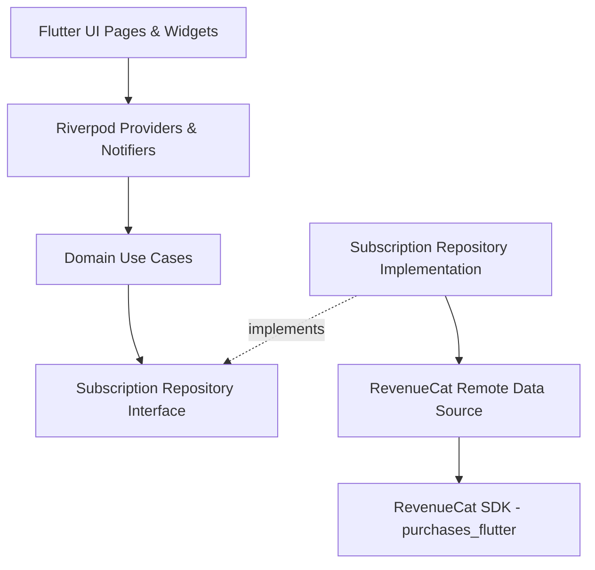
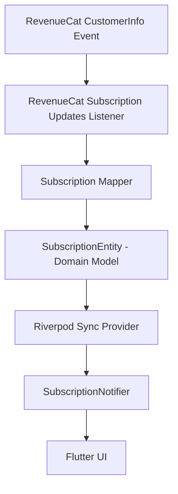
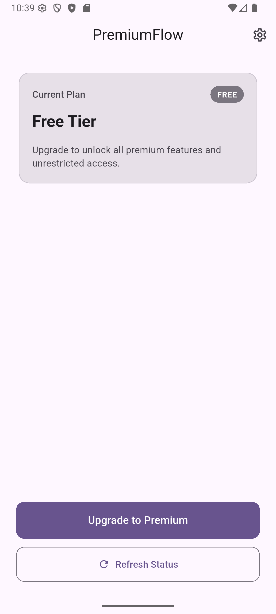
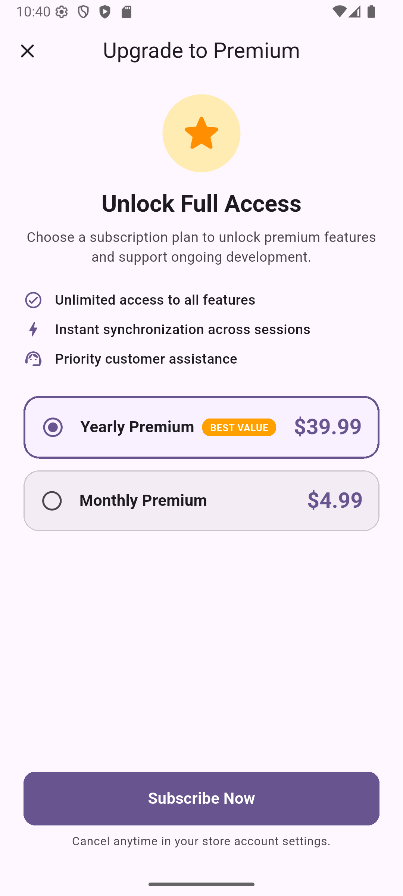
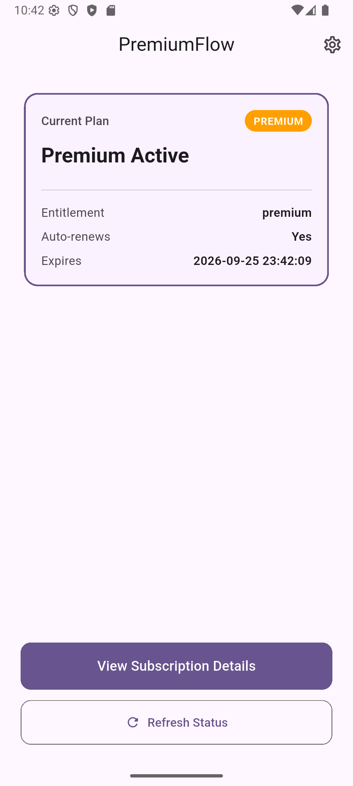
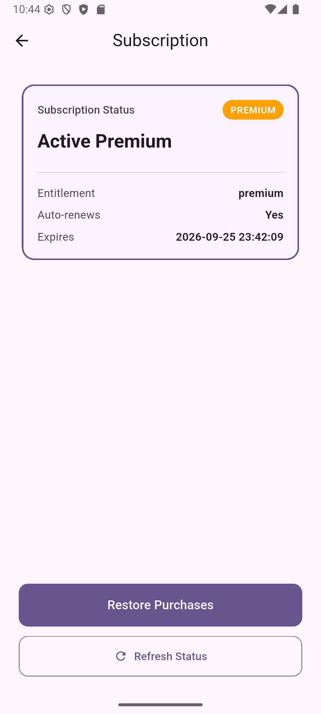

# PremiumFlow

> A production-style Flutter subscription reference project demonstrating RevenueCat, Riverpod, Clean Architecture, typed error handling, restore purchases, live CustomerInfo synchronization, automated testing, and CI.

[](https://github.com/Satti201/flutter-revenuecat-subscription-pattern/actions/workflows/flutter_ci.yml)
[](https://github.com/Satti201/flutter-revenuecat-subscription-pattern/actions)
[](https://flutter.dev)
[](https://riverpod.dev)
[](https://www.revenuecat.com)
[](#architecture)

---

## What This Project Demonstrates

- **Production-Style Subscription Architecture**: Pragmatic Clean Architecture dividing responsibilities strictly into Domain, Data, and Presentation layers.
- **RevenueCat Test Store Integration**: Operates fully end-to-end using RevenueCat's Test Store, allowing sandbox purchasing without requiring Apple Developer or Google Play Console merchant credentials.
- **Monthly & Annual Offerings**: Dynamic subscription plans fetched and displayed with period mappings and savings badges.
- **Complete Purchase & Restore Flows**: End-to-end flows with real-time feedback, distinct messaging for newly restored subscriptions vs. expired accounts, and immediate UI reactivity.
- **Live CustomerInfo Synchronization**: Subscribes to RevenueCat's customer info listener and pushes out-of-band updates into Riverpod without UI polling.
- **Domain Isolation from SDK Types**: Zero RevenueCat SDK models (`CustomerInfo`, `Package`, `Offering`, `PlatformException`) leak beyond the data layer.
- **Typed Domain Exceptions**: All platform and billing channel exceptions are mapped to domain-specific error types.
- **Concurrency & Duplicate Action Protection**: State-level guards prevent duplicate billing requests while transactions are already in flight.
- **Zero Hardcoded Secrets**: Secure environment-based API key injection through `--dart-define`.
- **51 Automated Tests & GitHub Actions CI**: Complete automated test suite covering configuration, mappers, repositories, stream listeners, notifiers, and UI widgets running in GitHub Actions.

---

## Key Features

- **Dynamic Paywall**: Shows available subscription offerings, highlights the recommended yearly plan with a *Best Value* badge, and enables seamless plan switching.
- **Subscription Settings Screen**: Dedicated management hub displaying status, entitlement ID, auto-renewal flag, and expiration timestamps.
- **Graceful Error Recovery**: Distinct UI retry states for network dropouts, inline loading spinners, and floating SnackBars for purchase rejections and cancellations.
- **Live Status Sync**: Automatically reflects renewals, expirations, or external subscription changes via RevenueCat stream synchronization.

---

## Architecture

This project enforces strict Clean Architecture boundaries:



### Live CustomerInfo Synchronization Flow

RevenueCat can emit customer updates outside the normal user actions (e.g. renewal events, web purchases, or background refresh). Rather than leaking SDK types into the presentation layer, updates flow through an isolated adapter pipeline:



---

## Subscription Flow

### 1. Purchase Flow
```text
User selects Plan on Paywall
    ↓
SubscriptionActionNotifier.purchasePlan(planId)  [sets isPurchasing = true]
    ↓
PurchasePlanUseCase(planId)
    ↓
SubscriptionRepository.purchasePlan(planId)
    ↓
SubscriptionRemoteDataSource.purchasePackage(package)
    ↓
RevenueCat SDK purchases package
    ↓
Repository maps CustomerInfo → SubscriptionEntity
    ↓
SubscriptionActionNotifier updates SubscriptionNotifier
    ↓
Paywall closes & Home Page displays Premium Tier immediately
```

### 2. Restore Purchases Flow
```text
User taps 'Restore Purchases' in Settings
    ↓
SubscriptionActionNotifier.restorePurchases()  [sets isRestoring = true]
    ↓
RestorePurchasesUseCase()
    ↓
SubscriptionRepository.restorePurchases()
    ↓
RevenueCat SDK restores transactions
    ↓
Repository maps CustomerInfo → SubscriptionEntity
    ↓
SubscriptionActionNotifier updates SubscriptionNotifier
    ↓
Settings displays:
  - "Premium subscription restored." (if entitlement active)
  - "Restore completed, but no active subscription was found." (if no active entitlement)
```

---

## Screenshots

| Home (Free Tier) | Paywall Screen | Home (Premium Tier) | Subscription Settings |
|:---:|:---:|:---:|:---:|
|  |  |  |  |

---

## Getting Started

### 1. Prerequisites
- [Flutter SDK](https://docs.flutter.dev/get-started/install) (version 3.19 or higher)
- Android Studio / VS Code with Flutter extension
- A free [RevenueCat account](https://app.revenuecat.com)

### 2. Clone and Install
```bash
git clone https://github.com/Satti201/flutter-revenuecat-subscription-pattern.git
cd flutter-revenuecat-subscription-pattern
flutter pub get
```

### 3. Run the App
```bash
flutter run --dart-define=REVENUECAT_API_KEY=your_revenuecat_api_key
```

---

## RevenueCat Test Store Setup

This reference app runs using RevenueCat's **Test Store**, requiring zero Google Play Console or Apple App Store setup.

1. In the [RevenueCat Dashboard](https://app.revenuecat.com), create a new Project named `PremiumFlow`.
2. Under **Project Settings** → **API Keys**, locate the **Test Store** public API key (starts with `test_`).
3. Under **Product Catalog**:
   - Create an **Entitlement** with Identifier: `premium` (Description: `Premium Access`).
   - Create two **Products**:
     - Product Identifier: `premium_monthly` (Type: Subscription, Duration: 1 Month)
     - Product Identifier: `premium_yearly` (Type: Subscription, Duration: 1 Year)
   - Attach both products to the `premium` entitlement.
4. Under **Offerings**:
   - Create a Default Offering with Identifier: `default`.
   - Add two **Packages** to this offering:
     - Package Identifier: `$rc_monthly` (associated with `premium_monthly`)
     - Package Identifier: `$rc_annual` (associated with `premium_yearly`)

> **Package Identifier Note**: Package identifiers (`$rc_monthly`, `$rc_annual`) are RevenueCat standard package abstractions. They decouple your app UI and business logic from underlying platform product IDs (`premium_monthly`, `premium_yearly`).

---

## Environment Configuration

The RevenueCat API key is injected at compile time via `--dart-define`.

```bash
# Debug mode on connected device or emulator
flutter run --dart-define=REVENUECAT_API_KEY=test_yourTestStoreApiKeyHere

# Release build
flutter build apk --dart-define=REVENUECAT_API_KEY=test_yourTestStoreApiKeyHere
```

> **Security Note**: The SDK key is **never hardcoded in source control**. The app includes a startup assertion (`RevenueCatConfig.apiKey`) that raises a descriptive `StateError` if the key was omitted during build.

---

## Testing

The codebase includes **51 automated tests** covering every layer of the architecture:

| Test Suite | File | Tests | Focus |
|:---|:---|:---:|:---|
| **Configuration** | `test/core/config/revenuecat_config_test.dart` | 1 | Ensures API key validation and helpful error messaging. |
| **Data Mappers** | `test/features/subscription/data/mappers/subscription_mapper_test.dart` | 5 | SDK `CustomerInfo` and `Package` mapping into pure domain entities. |
| **Repository** | `test/features/subscription/data/repositories/subscription_repository_impl_test.dart` | 12 | SDK error translation, user cancellations, and entity mapping. |
| **Live Sync** | `test/features/subscription/presentation/providers/subscription_customer_info_sync_test.dart` | 1 | Proves listener events update presentation state. |
| **Notifiers** | `test/features/subscription/presentation/notifiers/*` | 18 | `SubscriptionNotifier`, `PlansNotifier`, and `SubscriptionActionNotifier` guards. |
| **Widget UI** | `test/widget_test.dart` | 14 | Paywall interactions, plan switching, loading states, error SnackBars, and navigation. |

### Run Analyzer & Tests
```bash
# Run static analysis
flutter analyze

# Run all 51 automated tests
flutter test

# Run with test coverage
flutter test --coverage
```

---

## Error Handling

All platform exceptions and SDK errors are intercepted at the repository boundary and converted into strongly typed domain exceptions:

```dart
abstract class SubscriptionException implements Exception {
  final String message;
  const SubscriptionException(this.message);
}

class OfferingNotFoundException extends SubscriptionException { ... }
class PlanNotFoundException extends SubscriptionException { ... }
class PurchaseCancelledException extends SubscriptionException { ... }
class PurchaseFailedException extends SubscriptionException { ... }
class RestoreFailedException extends SubscriptionException { ... }
class SubscriptionLoadFailedException extends SubscriptionException { ... }
class PlansLoadFailedException extends SubscriptionException { ... }
```

### Safety Guarantees
- **User Cancellation**: `PurchasesErrorCode.purchaseCancelledError` is mapped to `PurchaseCancelledException`, preventing false error alerts.
- **Finally Reset Guarantee**: In `SubscriptionActionNotifier`, the `finally` block ensures `isPurchasing` and `isRestoring` flags are guaranteed to reset to `false` even if an unexpected exception or crash occurs.
- **Mutex Action Guards**: Prevents duplicate concurrent purchases or simultaneous purchase + restore calls.

---

## Project Structure

```text
lib/
├── core/
│   ├── config/
│   │   └── revenuecat_config.dart          # Validates injected API key
│   └── services/
│       └── revenuecat_service.dart         # SDK initialization
├── features/
│   └── subscription/
│       ├── data/
│       │   ├── datasources/                # SDK calls wrapper
│       │   ├── listeners/                  # SDK listener adapter
│       │   ├── mappers/                    # CustomerInfo / Package → Domain Entity
│       │   └── repositories/               # SDK exception translation boundary
│       ├── domain/
│       │   ├── entities/                   # SubscriptionEntity, SubscriptionPlanEntity
│       │   ├── exceptions/                 # Typed SubscriptionException hierarchy
│       │   ├── repositories/               # Abstract repository contract
│       │   └── usecases/                   # GetCurrentSubscription, GetPlans, Purchase, Restore
│       └── presentation/
│           ├── notifiers/                  # Riverpod Notifiers (State + Actions)
│           ├── pages/                      # HomePage, PaywallPage, SubscriptionSettingsPage
│           ├── providers/                  # Dependency injection & sync providers
│           └── states/                     # Immutable UI action states
└── main.dart                               # App entry point
```

---

## Design Decisions

1. **SDK Type Encapsulation**: Neither `CustomerInfo` nor `Package` is ever exposed to the Presentation layer. The entire UI consumes only domain-pure `SubscriptionEntity` and `SubscriptionPlanEntity`.
2. **Separation of Persistent vs. Transient State**:
   - `subscriptionNotifierProvider`: Holds the current subscription status (cached & synced).
   - `plansNotifierProvider`: Holds available subscription packages.
   - `subscriptionActionNotifierProvider`: Owns transient action state (`isPurchasing`, `isRestoring`, `errorMessage`).
3. **Dedicated Settings Screen for Restore**: Apple App Store Guidelines and Google Play policies require accessible restore functionality. Placing restore in dedicated Subscription Settings makes it accessible to both free and premium users without cluttering the paywall.

---

## Tech Stack

- **Framework**: [Flutter](https://flutter.dev) (Dart 3)
- **State Management**: [Flutter Riverpod](https://pub.dev/packages/flutter_riverpod)
- **In-App Purchases**: [Purchases Flutter (RevenueCat)](https://pub.dev/packages/purchases_flutter)
- **Architecture**: Clean Architecture (Domain, Data, Presentation)
- **CI / Automation**: GitHub Actions (`ubuntu-latest`, Flutter stable)
